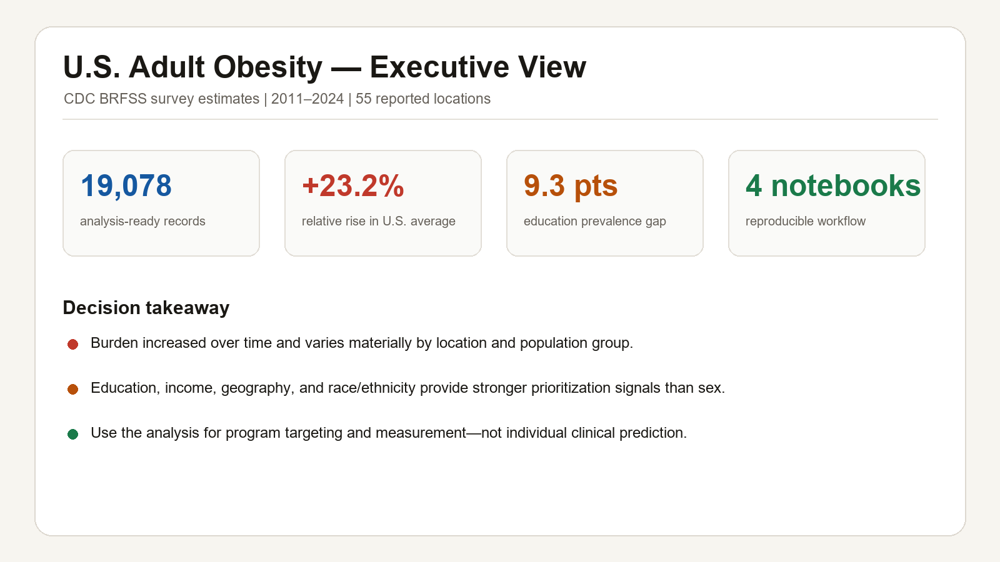
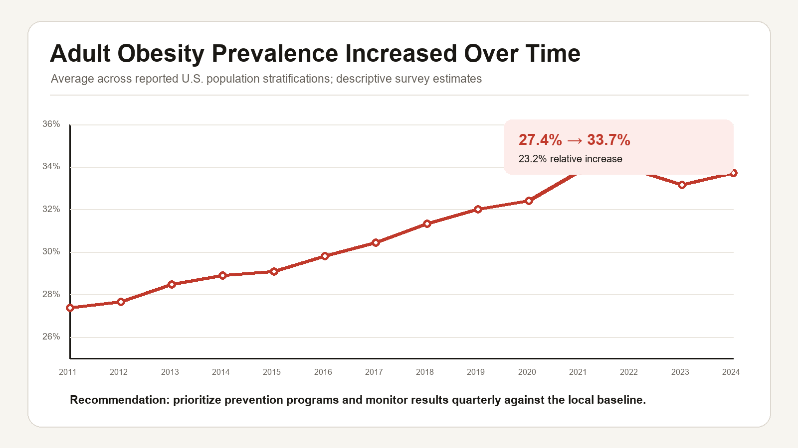
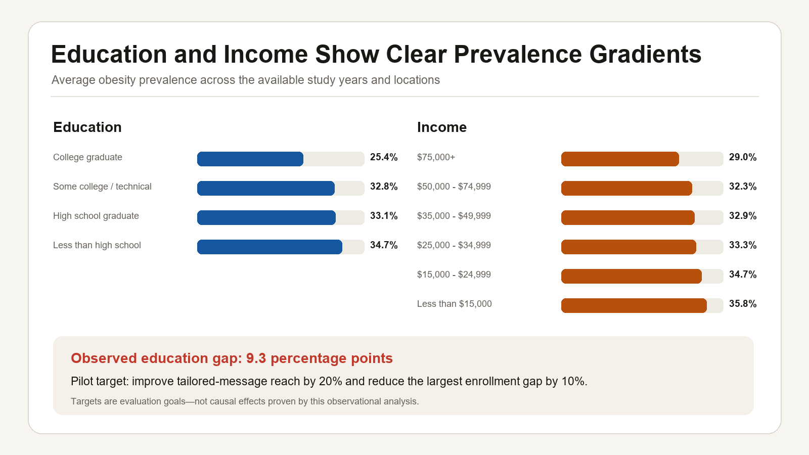
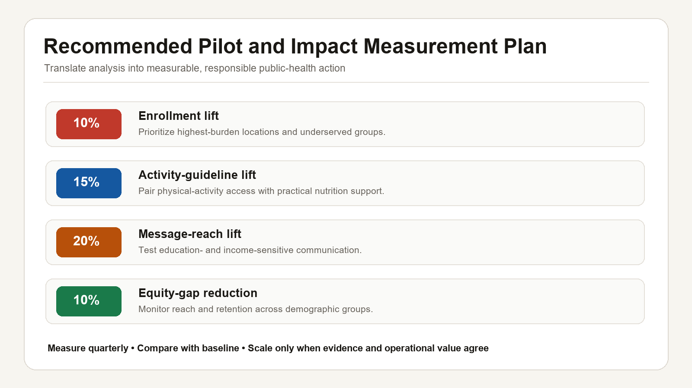

# U.S. Adult Obesity Insights

An end-to-end public-health analytics project using CDC BRFSS survey estimates (2011–2024). The work identifies geographic and demographic disparities, tests the strength of observed patterns, and turns the findings into measurable intervention targets.

## Live interactive dashboard

### [Open the live project →](https://faiyazanalytica.github.io/us-adult-obesity-insights/)

Explore national trends, state-level differences, demographic disparities, risk prioritization, and evidence-informed recommendations in the recruiter-facing dashboard.

> The dashboard is a static analytical demonstration hosted with GitHub Pages. Chart and map libraries load from public CDNs, so an internet connection is required.

## Project highlights

- Cleaned and validated 110,000+ source records while preserving the raw extract.
- Analyzed adult obesity prevalence across time, 55 reported locations, and key demographic groups.
- Used hypothesis tests and effect sizes to separate statistically significant findings from practical importance.
- Built prevalence-estimation and risk-tier models for decision support.
- Developed an interactive dashboard and program recommendations with 10–20% KPI targets.

## Executive view



## Selected findings

### Obesity prevalence increased over time



The average across reported U.S. population stratifications increased from approximately 27.4% in 2011 to 33.7% in 2024—a 23.2% relative increase. This supports continued prevention investment and quarterly monitoring against local baselines.

### Education and income disparities



The observed education gap is 9.3 percentage points between college graduates and adults with less than a high-school education. Because the source is observational, this is a prioritization signal rather than a causal estimate.

### Recommendations and impact targets



The proposed 10–20% improvements are pilot evaluation targets. They should be compared with a documented baseline and are not guaranteed intervention effects.

## Repository structure

```text
obesity-insights-analysis/
├── index.html                    # GitHub Pages entry point
├── data/
│   ├── raw/                  # Original CDC extract (read-only)
│   └── processed/            # Analysis-ready obesity records
├── notebooks/
│   ├── 01_data_cleaning.ipynb
│   ├── 02_exploratory_analysis.ipynb
│   ├── 03_statistical_analysis.ipynb
│   └── 04_modeling_and_recommendations.ipynb
├── notebook-html/            # Portable HTML exports of every notebook
├── reports/                  # Executive summary
├── screenshots/              # GitHub-ready recruiter visuals
├── live-project/             # Recruiter-facing interactive dashboard
├── archive/                  # Original submitted notebook
├── requirements.txt
└── README.md
```

## How to run

1. Create a Python environment and install `requirements.txt`.
2. Run notebooks in numeric order from the repository root.
3. Open `live-project/index.html` to view the dashboard. Its chart libraries and map data require an internet connection.

## Notebook HTML exports

The notebooks are also available as standalone HTML files for quick review without Jupyter:

- [Data cleaning](notebook-html/01_data_cleaning.html)
- [Exploratory analysis](notebook-html/02_exploratory_analysis.html)
- [Statistical analysis](notebook-html/03_statistical_analysis.html)
- [Modeling and recommendations](notebook-html/04_modeling_and_recommendations.html)

## Methods

Data quality review, exploratory analysis, Welch's t-test, one-way ANOVA, effect sizes, linear trend analysis, random-forest regression, and gradient-boosting classification.

## Responsible interpretation

BRFSS values are aggregated repeated cross-sectional survey estimates. Results describe associations and prioritization opportunities; they do not prove that a demographic characteristic causes obesity. Recommendation percentages are pilot KPI targets and must be validated against a local baseline.

## Data source

CDC, *Nutrition, Physical Activity, and Obesity: Behavioral Risk Factor Surveillance System*. The included extract covers 2011–2024.
